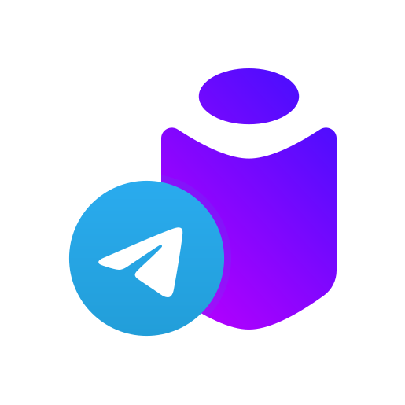

<div align="center">
  <a href="https://github.com/othneildrew/Best-README-Template">
    
  </a>

<h3 align="center">Telice</h3>
  <p align="center">
    Secure and easy to use <b>te</b>legram bot for A<b>lice</b>
    <br />
    <a href="https://t.me/telice_bot"><strong>Open it Telegram »</strong></a>
    <br/>
    <br/>
    <a href="https://github.com/kchsherbakov/telice/issues">Report Bug</a>
    ·
    <a href="https://github.com/kchsherbakov/telice/issues">Request Feature</a>
  </p>
</div>

## About

Telice is essentially designed to offer convenient way of sharing media with
Yandex.Stations through [Telegram](https://telegram.org).

Telice offers unique and well-thought experience comparing to other bots. Be sure that your interaction is secure
because of [Yandex ID](https://yandex.com/dev/id/).

> **Telice will never ask you for your account credentials!**

### Key features

- Free and easy to use
- Secure and user-friendly
- Share media[^1] with any of your Yandex.Station devices right away thanks to Yandex Smart Home
- View available devices to share with
- Choose Yandex.Station to share with or select one of them as your default playback device
- Support for multiple telegram accounts due to multisession nature

### How to use

Open [Telice](https://t.me/telice_bot). The bot will guide you through initial setup process.
You will be asked to navigate to the Yandex auth page to issue OAuth access token for the bot to use.

Once authorized feel free to send a message containing media link[^1] and select device to play it on.
You can set one of the available devices as default one to always use it for playback.

[^1]: Currently only YouTube is supported. I'm looking into adding support for other media providers.

#### Available commands

- `/start` - start authentication process
- `/listdevices` - list registered devices
- `/selectasdefault` - select one of the devices as default
- `/reset` - reset current session

## If you want your own Telice...

You can always clone this repo and build your own telice. It's Open Source, right?

### Prerequisites

- Create a Telegram bot and get a
  token. [How do I create a bot?](https://core.telegram.org/bots#3-how-do-i-create-a-bot)
- Create a Yandex client app and get a client id. [Create new client](https://oauth.yandex.com/client/new)
- Install `go`. [Download and install](https://go.dev/doc/install)

### Installation

1. Be done with prerequisites
2. Clone the repo
3. Setup ENV variables. Please refer to the [.env.example](.env.example)
4. `go run` it

**OR**

```shell
docker pull kchsherbakov/telice
```

## Contact

Konstantin Chsherbakov - https://kchsherbakov.com  
Project website - https://kchsherbakov.com/telice